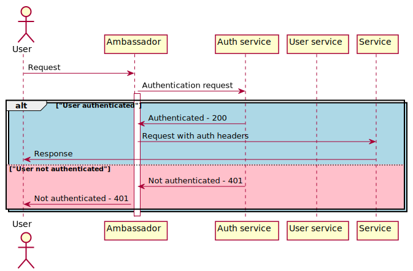

# HW BFF. Api Gateway

## Auth flow


### Clone the repo:
```bash
git clone https://github.com/alikhanmurzayev/otus_bff_api_gateway.git && cd otus_bff_api_gateway
```

### Start minikube
```bash
minikube start --cpus=4 --memory=4g --vm-driver=virtualbox
```

### Start services:
```bash
kubectl apply \
-f k8s/namespaces.yaml \
-f k8s/config.yaml \
-f k8s/postgres.yaml \
-f k8s/user-app.yaml \
-f k8s/auth-app.yaml
```

Ensure that services are running
```bash
watch kubectl get po -n default
```

## Setup ambassador:

### Install the Ambassador Edge Stack CRDs
```bash
helm repo add datawire https://app.getambassador.io && \
  helm repo update && \
  kubectl apply -f https://app.getambassador.io/yaml/edge-stack/2.2.2/aes-crds.yaml && \
  kubectl wait --timeout=5m --for=condition=available deployment emissary-apiext -n emissary-system
```

### Install the Ambassador Edge Stack Chart
```bash
helm install -n ambassador --create-namespace -f k8s/ambassador.yaml \
  edge-stack datawire/edge-stack && \
  kubectl rollout status  -n ambassador deployment/edge-stack -w
```

Ensure that ambassador is up
```bash
watch kubectl get po -n ambassador
```

### Setup routes and auth rules
```bash
kubectl apply -f k8s/ambassador-routes.yaml -f k8s/ambassador-auth.yaml -f k8s/ambassador-listener.yaml
```

### Run test:
```bash
newman run  \
--global-var "baseUrl=$(minikube service list|grep 'ambassador'|grep 'http'|grep -Eo 'http://[^ >]+'|head -1)" \
OTUS.API_Gateway.postman_collection.json
```
